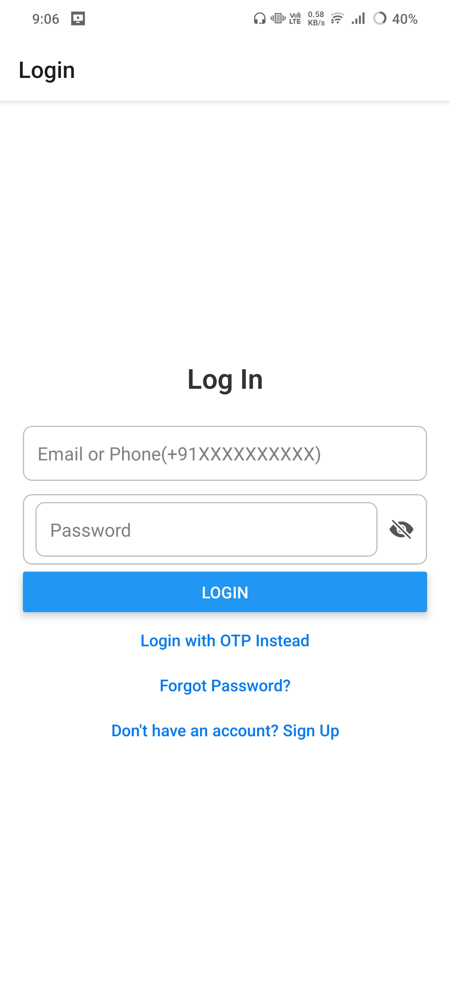
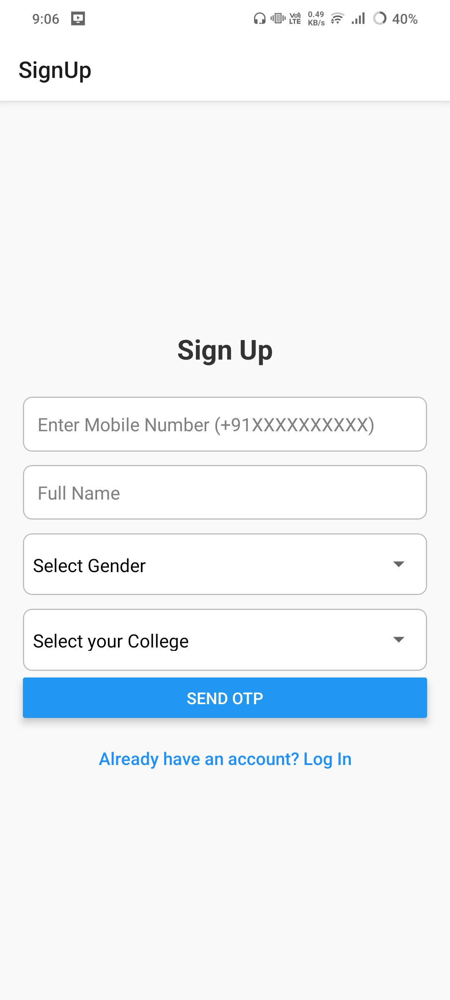
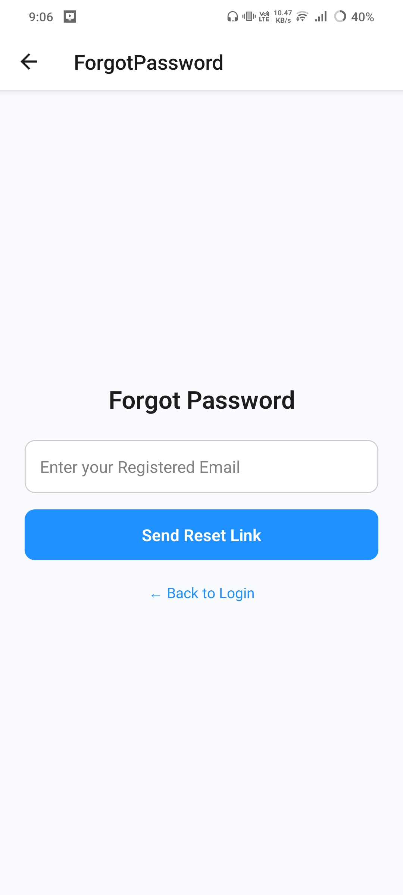
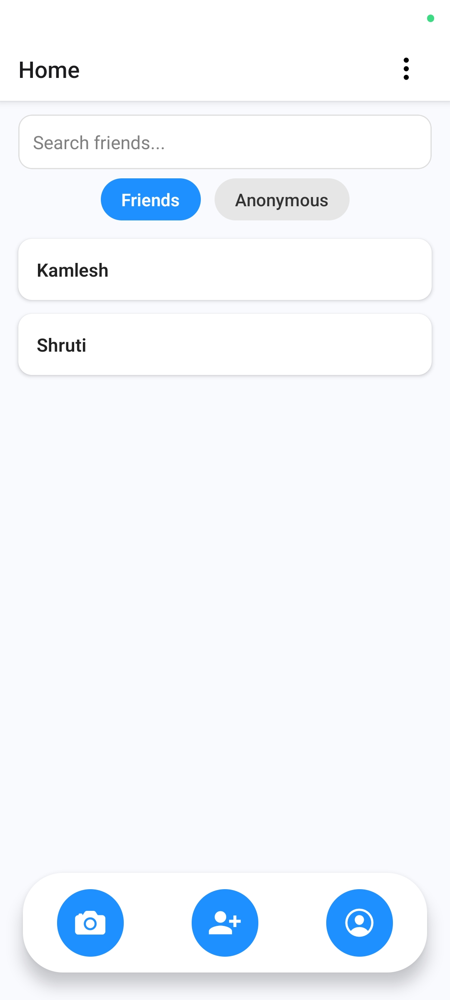

# 📸 Anonymous Face Blur Snap Sharing App (ghostgram)

A React Native Expo app that allows users to **capture face-blurred snaps** and anonymously **send them to second-degree friends** (friends of friends) within the same college community. Auth includes **OTP (Phone) + Email/Password with email verification**, **Firestore chat**, and **Firebase integration**.

---

## 🚀 Features

- 🔐 Multi-step SignUp with:
  - Mobile number OTP verification (Firebase Auth)
  - Email linking + Password (Firebase Auth)
  - College, Gender, and Name input
- 🔁 Login with:
  - Password (email/phone)
  - OTP (phone)
- 🤳 Snap Upload Flow:
  - Capture from **Vision Camera** or pick from gallery
  - Detect faces using `@react-native-ml-kit/face-detection`
  - Blur detected faces using `@shopify/react-native-skia`
  - Choose gender filter (Male, Female, Both)
  - Send blurred snap to **2nd-degree connections** only
- 💬 Anonymous Chat:
  - Firebase Firestore-backed chat
  - Messages include optional blurred images (base64 stored)
  - Supports anonymous/named toggles
- 🧑‍🤝‍🧑 Friends System:
  - Add / accept / reject friends
  - View received requests
  - Chat only after friendship
- 🔐 Secure Auth:
  - OTP login with reCAPTCHA support
  - Firebase Email Verification
  - Change Password & Forgot Password screens

---

## 📦 Tech Stack

| Tool / Library | Purpose |
|----------------|---------|
| **React Native (Expo Dev Client)** | Core framework |
| **Firebase Auth + Firestore** | Auth, DB, chat |
| **react-native-vision-camera** | Camera input |
| **@shopify/react-native-skia** | Face blurring (canvas drawing) |
| **@react-native-ml-kit/face-detection** | Face detection |
| **react-native-popup-menu** | Context menus |
| **ViewShot + base64** | Snap screenshot + sharing |
| **Expo Modules** | FileSystem, MediaLibrary, ImagePicker |

---

## 📂 Folder Structure (Important Files)

```
.
├── App.js                         # Main navigation
├── firebaseConfig.js             # Firebase init
├── screens/
│   ├── LoginScreen.js
│   ├── SignUpScreen.js
│   ├── HomeScreen.js
│   ├── SnapUploadScreen.js
│   ├── ChatScreen.js
│   ├── AddFriendsScreen.js
│   ├── ReceivedRequestsScreen.js
│   ├── ForgotPassword.js
│   └── ChangePasswordScreen.js
```

---

## 🔧 Setup Instructions

### 1. Clone & Install

```bash
git clone <repo-url>
cd <ghostgram>
npm install
```

### 2. Firebase Setup

- Create a Firebase project
- Enable **Email/Password** and **Phone (OTP)** login
- Add Firestore rules & Firebase config
- Replace values in `firebaseConfig.js`

### 3. Permissions (Expo)

Ensure these permissions are added in `app.json` or `AndroidManifest.xml`:

```jsonc
"android": {
  "permissions": [
    "CAMERA",
    "READ_EXTERNAL_STORAGE",
    "WRITE_EXTERNAL_STORAGE",
    "INTERNET",
    "RECORD_AUDIO"
  ]
}
```

---

## 🧪 Testing

- To install Android internal distribution build [click here](https://expo.dev/accounts/akhil_28_11/projects/ghostgram/builds/c1e833df-b384-4eff-9405-fae6dc87624a)

- Test on a **real device** with **Expo Dev Client**
- Use **physical camera** to detect and blur faces
- OTP auth should work with live Firebase project
- Test with at least 3 accounts to verify 2nd-degree logic


---

## 📸 Demo Screenshots

__
__
__
__
__
__
__
__
__

---

## 🧑‍💻 Author

**Akhil Kancharla**  
_B.Tech Electrical Engineering 4th year_
_IIT Roorkee_

---
